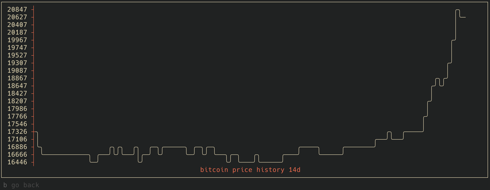

## coincap-tui
coincap-tui let's you check crypto prices in your terminal.

Features:
- fetch crypto assets data from [ coincap ](https://docs.coincap.io/) REST API
- save favourites 
- display results in tabular format
- nice UI with [bubble-tea](https://github.com/charmbracelet/bubbletea)


table with crypto assets



price history for the last 14 days

## :keyboard: keybindings

|      Key      |                Description                |
| :-----------: | :---------------------------------------: |
|     `r`       |           refresh data                    |
|   `enter`     |           show price history graph.       |
|   `a`         |           show all assets.                |
|   `f`         |           toggle favourite                |
|   `F`         |           show favourites                 |
|      `b`      |           go back                         |
|     `j`       |             go down                       |
|     `k`       |              go up                        |
| `g, home`     |         go to top                         |
| `G, end`      |        go to end                          |
| `ctrl-c`      |                exit                       |


## installation

Requires GO

```
$ go install github.com/tomekz/coincap-tui@latest
```

## usage

```
$ coincap-tui
```

## dev

```sh
$ go run main.go
```

## acknowledgments

Inspired by [tinance](https://github.com/Alcadramin/tinance)
