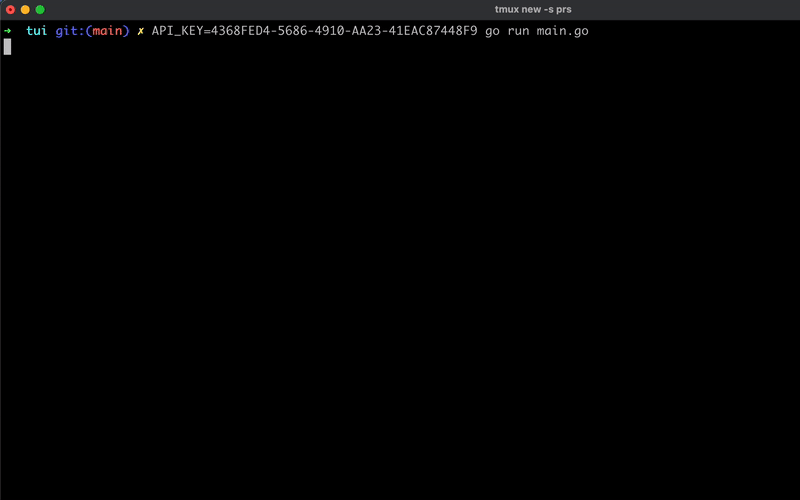

# tui

A small terminal UI app written while learning GO

Features:

- nice UI with [bubble-tea](https://github.com/charmbracelet/bubbletea)
- fetch crypto assets data from [ coinapi ](https://www.coinapi.io/) REST API
- display results in tabular format

  

# how to run

```sh
 API_KEY=0B5A90AF-892D-4917-8A4F-5B20D91846E0 go run main.go
```

> If the request limit for my `API_KEY` is exhausted you will have to get your own free [ coinapi ](https://www.coinapi.io/) api key
