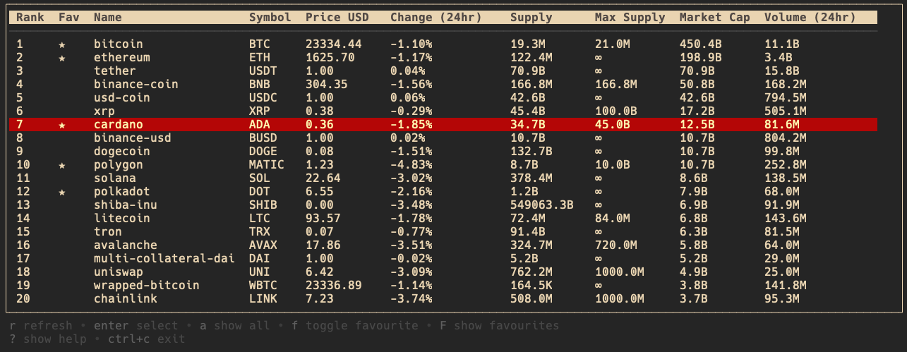
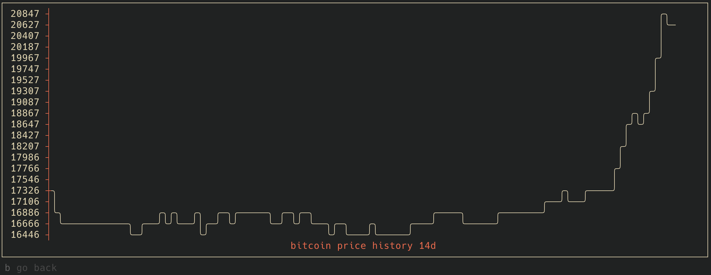

## coincap-tui
coincap-tui let's you check crypto prices in your terminal.

Features:
- fetch crypto assets data from [ coincap ](https://docs.coincap.io/) REST API
- save favourites 
- display results in tabular format
- nice UI with [bubble-tea](https://github.com/charmbracelet/bubbletea)



table with crypto assets



price history for the last 14 days

## :keyboard: keybindings

|      Key      |                Description                |
| :-----------: | :---------------------------------------: |
|     `r`       |           refresh data                    |
|   `enter`     |           show price history graph.       |
|   `a`         |           show all assets.                |
|   `f`         |           toggle favourite                |
|   `F`         |           show favourites                 |
|      `b`      |           go back                         |
|     `j`       |             go down                       |
|     `k`       |              go up                        |
| `g, home`     |         go to top                         |
| `G, end`      |        go to end                          |
| `ctrl-c`      |                exit                       |


## installation

**go**:

```
$ go install github.com/tomekz/coincap-tui@latest
```

**apt**:

```sh
echo 'deb [trusted=yes] https://apt.fury.io/tomekz/ /' | sudo tee /etc/apt/sources.list.d/fury.list

sudo apt update
sudo apt install coincap-tui
```

**yum**:

```sh
echo '[tomekz]
name=tomekz
baseurl=https://yum.fury.io/tomekz/
enabled=1
gpgcheck=0' | sudo tee /etc/yum.repos.d/fury.repo
sudo yum install coincap-tui

```

**deb/rpm/apk**:

Download the `.apk`, `.deb` or `.rpm` from the [releases page](https://github.com/tomekz/coincap-tui/releases) and install with the appropriate commands.

## usage

```
$ coincap-tui
```

## dev

```sh
$ go run main.go
```

## acknowledgments

Inspired by [tinance](https://github.com/Alcadramin/tinance)
